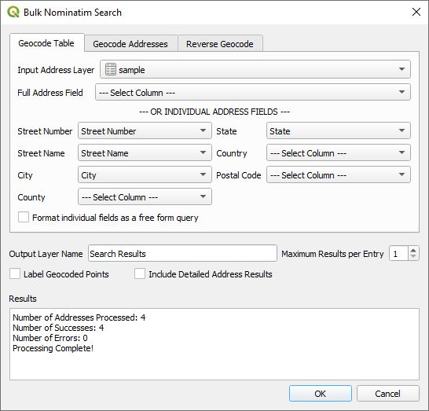

# Bulk Nominatim Plugin

The ***Bulk Nominatim QGIS Plugin*** interfaces with an OpenStreetMap nominatim service to provide geocoding of addresses and reverse geocoding of coordinates. This plugin is only recommended to be used with personal nominatim servers because OpenStreetMap does not permit bulk nominatim requests.

## Installation
The plugin can be installed by downloading the latest version from `https://github.com/NationalSecurityAgency/qgis-bulk-nominatim`. Launch QGIS and select ***Plugins->Manage and Install Plugins...*** from the menu. Click on the ***Install from ZIP*** tab on the left, click on the `...` button on the right to navigate to where you saved the bulk nominatim downloaded ZIP file and select it then click on the ***Install Plugin*** button. Click the ***Close*** button and you are ready to start address geocoding.

## Bulk Nominatim Tools

The plugin ***Settings*** need to be configured to point to a nominatim endpoint. See the ***Settings*** section on how to do this. The plugin can be accessed from the `Plugins->Nominatim GeoCoding` menu or from the two tool bar icons.

The menu items are:

*  ***Bulk GeoCoding*** - Main tool for bulk geocoding of addresses to coordinates and bulk reverse geocoding of coordinates to addresses.
*  ***Reverse Point GeoCoding*** - This tool allows the user to click on the map to determine the closest address or feature.
*  ***Settings*** - Configuration for the **Nominatim Service URL** as well as other settings.
*  ***Help*** - Displays help information for the tools.

Both ***Bulk GeoCoding*** and ***Reverse Point GeoCoding*** are installed on the tool bar for quick access.

### Bulk GeoCoding

Selecting this tool provides 3 different methods of geocoding. All three return a new vector layer.

* ***Geocode Table*** - Input is either a QGIS table or vector layer containing address information. ***Input Address Layer*** contains a list of tables and vector layer. Select one that contains the address information needed. The plugin will attempt to find matches for the individual address fields *Street Number*, *Street Name*, *City*, *County*, *State*, *Country*, and *Postal Code*. The address fields can also be manually selected. If one of the fields contains the entire address select it from ***Full Address Field***. This overrides all the other field selections.
* ***Geocode Addresses*** - This is a text area where you can paste in addresses - one per line. The addresses are address strings and not individual fields.
* ***Reverse Geocode*** - Input is a points layer and it attempts to find the closest address for each point. For remote locations the closest feature may be an administrative boundary.

Across the top are three tabs representing these three geocoding tools. The lower part of the dialog box has common functionality for the three tools and are:

* ***Output Layer Name*** - This is the name of the vector layer that will be created in QGIS. Note that this is a memory vector layer and not a file layer. If you want to retain the results you will need to save the layer.
* ***Maximum Results per Entry*** - For each address multiple results can be returned. (Not applicable for ***Reverse Geocode***.)
* ***Label Geocoded Points*** - Automatically show the labels in QGIS for the geocoded point.
* ***Included Detailed Address Results*** - Returns an enhanced table of address details.
* ***Results*** - Shows the results of the geocoding and any addresses that failed.

Clicking on the ***OK*** button causes the plugin to start geocoding.

### Reverse Point GeoCoding
Clicking on this tool allows the user to be able to click on the map and return the closet feature/address in a dockable window. Note that the closes feature may be an administrative boundary or another feature that is not that close to the point clicked on. If the nominatim service is using the latest software, the actual polygon or point of the located feature will be displayed.

## Settings
In ***Settings*** the user can select the Nominatim Service URL endpoint, the maximum number of addresses to geocode and for reverse geocoding the level of detail where 0 represents the country and 18 the address number. Here is the dialog window.

Please note that this plugin is designed to use commercial or personal Nominatim services. The OpenStreetMap URL displayed here is not for bulk use as it violates their policy and will result in the user being blocked from their site for a period of time.